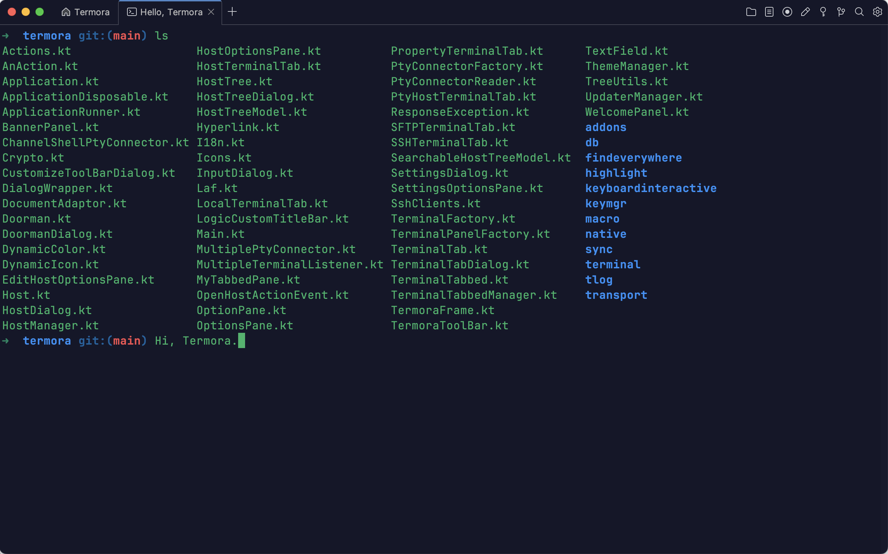

<a href="./README.zh_CN.md">🇨🇳 简体中文</a>

# Termora

**Termora** is a terminal emulator and SSH client for Windows, macOS and Linux.

  

**Termora** is developed using [Kotlin/JVM](https://kotlinlang.org) and partially implements the [XTerm](https://invisible-island.net/xterm/ctlseqs/ctlseqs.html) protocol (with ongoing improvements). Its ultimate vision is to achieve full platform support (including Android, iOS, and iPadOS) through [Kotlin Multiplatform](https://kotlinlang.org/docs/multiplatform.html).

## Features

- SSH and local terminal support
- Serial port protocol support
- [SFTP](./docs/sftp.png?raw=1) & [Command](./docs/sftp-command.png?raw=1) file transfer support
- Compatible with Windows, macOS, and Linux
- Zmodem protocol support
- SSH port forwarding & Jump hosts
- Support for X11 and SSH-Agent
- Terminal log
- Configuration synchronization via [Gist](https://gist.github.com) & [WebDAV](https://developer.mozilla.org/docs/Glossary/WebDAV)
- Macro support (record and replay scripts)
- Keyword highlighting
- Key management
- Broadcast commands to multiple sessions
- [Find Everywhere](./docs/findeverywhere.png?raw=1) quick navigation
- Data encryption
- ...

## Download

- [Latest release](https://github.com/TermoraDev/termora/releases/latest)
- [Homebrew](https://formulae.brew.sh/cask/termora): `brew install --cask termora`
- [WinGet](https://github.com/microsoft/winget-pkgs/tree/master/manifests/t/TermoraDev/Termora): `winget install termora`

## Development

It is recommended to use the [JetBrainsRuntime](https://github.com/JetBrains/JetBrainsRuntime) version of the JDK and run the program via `./gradlew :run` to run the program.

The program can be run via `./gradlew dist` to automatically build the local version. On macOS: `dmg`, on Windows: `zip`, on Linux: `tar.gz`.

## LICENSE

This software is distributed under a dual-license model. You may choose one of the following options:

- AGPL-3.0: Use, distribute, and modify the software under the terms of the [AGPL-3.0](https://opensource.org/license/agpl-v3).
- Proprietary License: For closed-source or proprietary use, please contact the author to obtain a commercial license.
